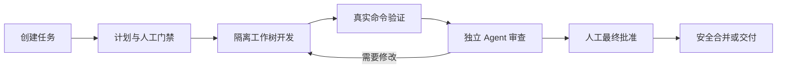

# AgentFlow

> 本地优先的多 Agent 软件工程控制台。让不同 AI 编程工具在一条可验证、可审查、可恢复的交付链路中协作。

AgentFlow 不是另一个聊天窗口，也不是把多个模型按钮堆在一起。它是一套运行在本机的工程控制面：把需求交给开发 Agent，在隔离工作树中产生改动，执行真实验证，再由独立 Provider 审查，最后交给人确认并安全合并。

项目仓库名仍为 AgentDock，桌面产品和运行时名称为 **AgentFlow**。

> 当前版本：`0.1.0` 技术预览。主要面向 macOS 本地开发与验收；公开分发所需的 Developer ID 签名和 Apple notarization 尚未完成。

## 为什么需要 AgentFlow

单独使用一个 AI CLI 很方便，但复杂任务通常还会遇到这些问题：

- 一个 Agent 同时写代码、声称测试通过并审查自己，缺少独立制衡。
- Claude Code、Codex、Qoder、Grok 等工具各有登录、参数、输出和权限差异，升级后容易突然失效。
- CLI 退出不等于任务完成，模型说“通过”也不等于验证真的执行过。
- 多轮修改、失败重试、额度耗尽和 Provider 降级后，很难知道当前仓库究竟处于什么状态。
- 自动化如果没有权限边界、预算门禁和人工检查点，越强越难放心使用。

AgentFlow 的作用，是把这些不确定性变成明确的工程事实：谁在执行、改了什么、验证是否真的通过、审查发现了什么、为什么停住，以及下一步需要谁做什么。

## 它如何工作



每一轮执行都绑定任务、revision、commit 和 Provider。SQLite 事件与 Git 提交是权威事实，桌面端只展示后端已经确认的状态，不用前端动画或模型文案猜测任务进度。

## 核心能力

### 多 Provider 编排

- 按角色选择规划、开发和审查 Provider。
- 开发与审查可以使用不同 Agent，避免自己审查自己。
- 支持有界 fallback、结构化结果修复、审查委员会和跨轮次返工。
- 在任务开始前并行执行版本、认证、能力和最小真实探针；不可运行时安全阻断。
- 固定版本支持矩阵与 CI 漂移检测，避免 CLI 更新悄悄破坏执行契约。

### 真实状态闭环

- 区分运行中、等待人工、权限请求、验证失败、审查失败、合并冲突和已合并。
- “验证通过”必须来自真实命令结果，“审查通过”必须有独立审查证据。
- 延迟事件不能让已阻断或已合并的任务重新显示为运行中。
- 桌面端提供执行轨道、Diff、审查、日志、治理和验收证据，不把技术细节塞进一条模糊进度消息。

### Git 隔离与安全交付

- 每个任务在专用 worktree 中执行，不直接污染用户当前工作区。
- Provider 降级前恢复到本轮起点，避免失败 Agent 的残留影响后续尝试。
- revision 使用不可变提交记录，支持跨轮追踪、复验和恢复。
- 提交门禁会阻止凭据、可疑秘密、超大文件、海量文件和构建依赖目录进入交付提交。
- 最终合并由明确事实和人工批准驱动，不把“本地生成结果”伪装成“已经交付”。

### 权限、隔离与数据边界

- 统一权限代理处理命令、网络、依赖安装、工作树外路径、Git mutation 和环境变量访问。
- 普通安全动作可按策略执行，越界动作暂停任务并请求一次、本任务或项目级授权。
- 恢复 token 使用 macOS Keychain 保护；API 凭据使用 Keychain 或环境变量，不写入 SQLite。
- API Provider 只有在任务明确允许数据外发后才能接收任务内容或 Diff。
- 可使用 Lima 隔离节点执行高风险验证，并为断网验证提供 fail-closed 网络命名空间。

### 可靠运行与治理

- 后台 daemon 让任务在桌面窗口关闭后继续运行。
- 支持队列并发、Provider 限流、超时、预算、停止、恢复和异常进程回收。
- 保存脱敏审计事件、验证结果、审查问题、预算用量和恢复原因。
- 支持本地通知、日志保留策略、可恢复任务回收站和审计导出。

### 产品化桌面控制台

- 首页以“需要你处理”的决策队列为中心，而不是装饰性统计面板。
- 任务详情围绕当前事实、执行轨道、验收证据和唯一下一步组织。
- 新建任务分为基础配置与“运行和治理”高级设置。
- 设置页分离环境、Provider、执行、权限、安全与存储、通知。
- 支持紧凑密度、键盘导航、reduced motion 和 800×600 至宽屏布局。

## 技术栈与工具职责

AgentFlow 不是单一框架项目。下面这些工具共同组成了从 Agent 执行到桌面验收的完整系统：

| 层级 | 使用的工具或技术 | 在 AgentFlow 中负责什么 |
| --- | --- | --- |
| 核心语言 | Rust 2024 | 任务状态机、Provider 适配、Git 操作、权限、持久化、进程监管和发布门禁 |
| 异步运行时 | Tokio | 并发 Provider 探针、后台任务、超时、取消、进程和网络 I/O |
| 本地服务 | Axum | daemon 与桌面/CLI 之间的本地服务接口 |
| 数据存储 | SQLite + SQLx | 保存项目、任务、revision、运行、审查、权限和审计事实 |
| 数据契约 | Serde、JSON Schema、Specta | 校验 Provider 结构化输出，并生成 Rust/TypeScript 共享契约 |
| 网络客户端 | Reqwest + rustls | 在明确数据外发授权后访问 API Provider，避免依赖系统 OpenSSL |
| 桌面外壳 | Tauri 2 | 将 Rust 后端与 macOS 桌面界面、系统通知和 sidecar 打包在一起 |
| 前端 | React 18 + TypeScript | 首页队列、任务详情、设置、权限审批和治理控制台 |
| 构建与样式 | Vite 5 + Tailwind CSS 4 | 前端开发服务器、生产构建和语义化设计令牌 |
| 无障碍组件 | Radix UI | Dialog、Select、Tabs、Tooltip、Switch 等键盘与焦点行为 |
| 服务端状态 | TanStack Query | 后端事实查询、缓存、刷新和 mutation 生命周期 |
| 本地界面状态 | Zustand | 侧栏、密度模式和技术日志等非业务 UI 状态 |
| 代码与 Diff | Monaco Editor | 只读代码、变更对比和技术证据查看 |
| JavaScript 工具链 | Bun | 安装依赖、类型检查、单元测试和桌面构建脚本 |
| 视觉验收 | Playwright | 固定夹具截图、窗口尺寸、200% 缩放和异常状态回归 |
| 版本与隔离 | Git + worktree | 每任务独立工作树、revision 提交、恢复、比较和安全合并 |
| macOS 凭据 | Keychain + security-framework | 保存 API key 和 Provider resume token，避免进入 SQLite 或日志 |
| 后台运行 | macOS LaunchAgent | 桌面窗口关闭后继续调度任务并恢复 daemon |
| 强隔离验证 | Lima + OpenSSH | 在不挂载宿主目录的 Linux VM 中执行远程或断网验证 |
| 自动化门禁 | GitHub Actions | Rust 跨平台测试、桌面契约、Provider 固定版本和视觉回归 |
| 发布校验 | codesign、spctl、hdiutil、SHA-256 | 检查 macOS `.app`/DMG 完整性并阻止不合格产物发布 |

### 接入的 AI 工具

AgentFlow 负责调用和约束这些外部 AI 工具，但不会读取它们的 OAuth token，也不会把“已安装”误判为“可执行”：

| 工具 | 可承担的角色 | AgentFlow 提供的控制 |
| --- | --- | --- |
| Claude Code | 计划、开发、审查 | 动态 Bash 权限恢复、登录检测、结构化结果和有界恢复 |
| Codex CLI | 计划、开发、审查 | sandbox、严格 schema、临时会话和用量归一化 |
| Qoder CLI | 计划、开发、审查 | 固定版本矩阵、真实探针、非交互权限模式和安全降级 |
| Grok CLI | 计划、开发、审查 | 结构化输出、sandbox、辅助模型请求兼容和凭据隔离 |
| Gemini CLI / Qwen Code | 开发、审查候选 | 能力检测；只有满足版本、认证和探针要求后才进入任务链 |
| Kimi CLI / MiniMax CLI | 可扩展 CLI 候选 | Provider 目录展示和兼容矩阵约束，未验证版本不会自动放行 |
| OpenAI / Anthropic / DeepSeek / Grok / MiniMax / Kimi API | 计划、开发或独立审查 | 每任务数据外发批准、Keychain 凭据、限流、预算和响应协议校验 |
| 外部 Provider sidecar | manifest 声明的角色 | Provider Protocol、能力协商、最小权限、隔离和一致性测试 |

## 可以用来做什么

- 让 Qoder 开发、Grok 或 Codex 独立审查，再由你批准合并。
- 在主要 Provider 额度不足、登录失效或输出协议变化时，按安全降级链继续任务。
- 为一个需求连续生成多个 revision，并保留每轮验证和审查依据。
- 把测试、CI、权限、预算和高风险文件变更纳入同一批准流程。
- 在本机或隔离的远程/Lima 节点复验固定 commit。
- 通过桌面端管理任务，也可以在无界面环境下使用 CLI 查询、恢复、批准、合并或取消。
- 通过 Provider Protocol 接入符合能力、权限和结构化输出契约的外部 Provider sidecar。

## Provider 支持

AgentFlow 当前数据模型和桌面目录覆盖以下 Provider。某个 Provider 是否能进入真实任务链，仍取决于本机安装、登录状态、固定版本兼容性和运行探针结果。

| 类型 | Provider |
| --- | --- |
| 本地 CLI | Claude Code、Codex、Gemini CLI、Qwen Code、Qoder CLI、Grok CLI、Kimi CLI、MiniMax CLI |
| 原生/API | OpenAI、Anthropic、DeepSeek、Grok、MiniMax、Kimi |
| 扩展 | Provider Protocol 外部 sidecar |

支持矩阵的状态不是装饰：`verified`、`compatible_untested` 和 `unsupported` 会直接影响预检和任务调度。详细规则见 [Provider 兼容策略](./config/README.md)。

## 快速开始

### 环境要求

- macOS（当前主要开发和实机验收平台）
- Rust stable
- Bun
- Git
- 至少一个已经安装并完成登录的兼容 AI CLI，或一个已配置的 API Provider

先检查本机环境：

```bash
cargo run -p agentflow-cli -- env-check
cargo run -p agentflow-cli -- setup check
```

### 启动桌面端

```bash
cd apps/desktop
bun install
bun run app:dev
```

构建本地 `.app` 和 DMG：

```bash
cd apps/desktop
bun run app:build
```

构建产物位于：

```text
apps/desktop/src-tauri/target/release/bundle/macos/AgentFlow.app
apps/desktop/src-tauri/target/release/bundle/dmg/
```

这些本地构建默认不等于可公开分发版本。正式发布前还需要 Developer ID 签名、notarization 和发布门禁。

### 使用 CLI 创建任务

```bash
cargo run -p agentflow-cli -- run-task \
  --repo /absolute/path/to/repository \
  --title "修复登录状态不同步" \
  --desc "复现问题，补充测试，通过独立审查后等待人工批准"
```

常用的无界面操作：

```bash
agentflow-cli task status <task-id>
agentflow-cli task resume <task-id> --guidance "根据审查意见继续修复"
agentflow-cli task approve <task-id>
agentflow-cli task merge <task-id>
agentflow-cli task cancel <task-id>
```

### 运行后台服务

```bash
cargo build --release -p agentflow-daemon --bin agentflowd
target/release/agentflowd install-service
target/release/agentflowd status
```

## 项目结构

```text
apps/desktop/                 Tauri + React 桌面控制台
crates/orchestrator/          任务状态机、调度、恢复与治理
crates/agent-adapters/        内置 CLI/API Provider 适配
crates/provider-protocol/     外部 Provider 协议与一致性测试
crates/process-supervisor/    子进程、日志、超时和回收
crates/git-engine/            worktree、revision、提交与合并门禁
crates/persistence/           SQLite 持久化与迁移
crates/daemon/                后台调度与本地服务
crates/cli/                   无界面命令行入口
config/                       Provider 支持矩阵与隔离配置
scripts/                      验证、发布和环境脚本
```

## 验证改动

运行完整 Rust 与前端门禁：

```bash
scripts/verify.sh
scripts/verify.sh --full
```

桌面端专项检查：

```bash
cd apps/desktop
bun run typecheck
bun test
bun run test:visual
```

视觉回归覆盖首页、人工决策队列、运行中、多 Agent 审查、Provider fallback、权限请求、验证失败、等待批准、已合并、新建任务、设置页以及不同窗口尺寸和 200% 缩放。

## 安全原则

- Agent 的自然语言总结不能替代 Git、验证、审查或交付事实。
- 未检测不显示为成功，已安装不显示为已登录，本地合并不显示为远端交付。
- 高风险能力默认 fail closed；缺少隔离、凭据或明确授权时暂停，而不是静默放宽权限。
- 不读取或展示 Provider OAuth token；敏感值不进入日志、任务事件和普通 UI。
- 本项目仍处于技术预览阶段。请先在可恢复的代码仓库和测试环境中使用，不要把它视为无人监督的生产变更系统。

## 进一步阅读

- [核心实现方案](./01-核心实现方案-v1.1-Codex.md)
- [Provider 协议](./04-Provider协议-v1.0.md)
- [权限代理与最小授权协议](./06.00-P0-统一权限代理与最小授权协议-v1.0-Codex.md)
- [CLI 持续适配、macOS 分发与端到端验收](./07-CLI持续适配、macOS正式分发与生产级端到端验收-v1.0-Codex.md)
- [前端产品化改进清单](./AgentDock_前端去AI味与产品化改进清单_2026-07-29.md)

## License

Rust workspace 当前声明为 MIT。仓库正式对外发布前仍应补充独立的许可证文本与版权信息。
